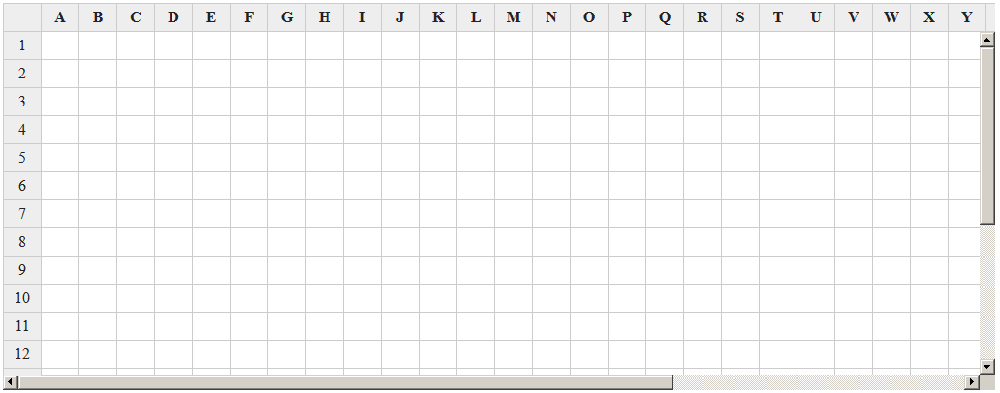
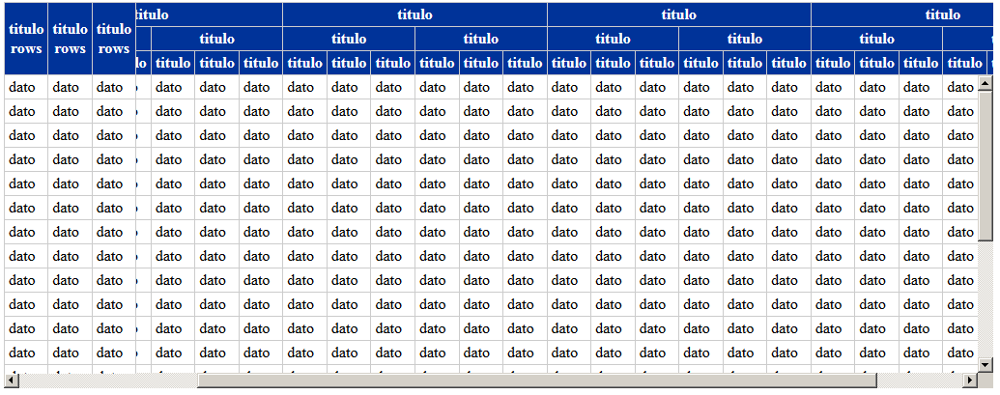

# jQuery Freeze Table Column and Rows

This is a jQuery plugin that can make table rows and columns not scroll.  It can take a given HTML table object and set it so it can freeze a given number of columns or rows or both, so the fixed columns or rows do not scroll.  The rows to be frozen should be placed in the table head section.  It can also freeze rows and columns combined with using colspan or rowspan attributes.

Examples
--------

--------

